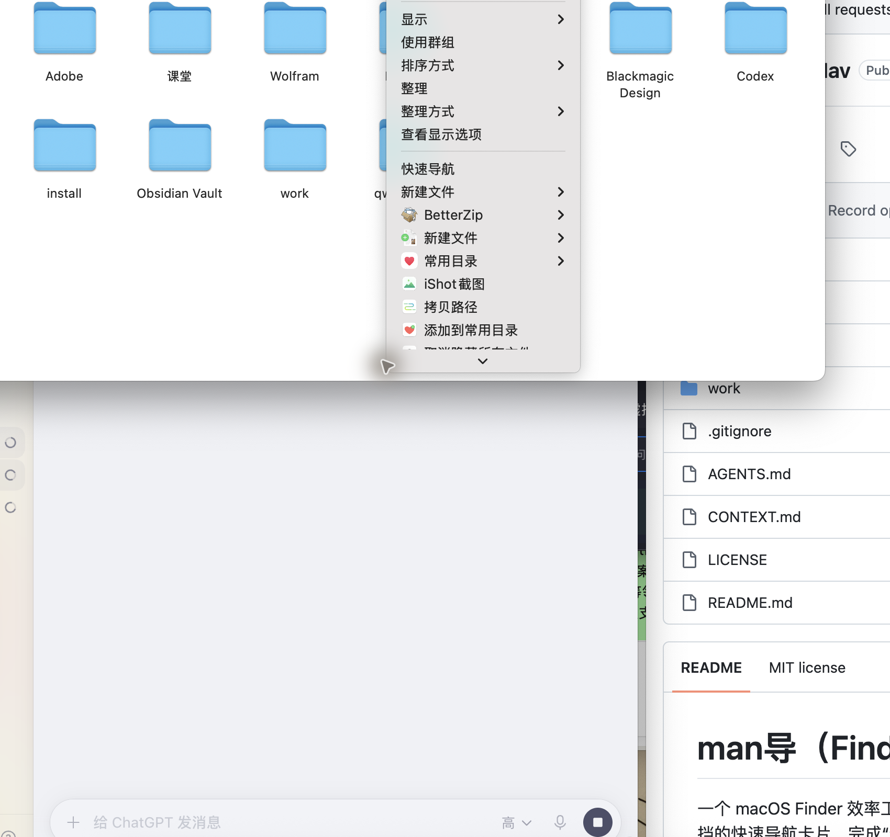
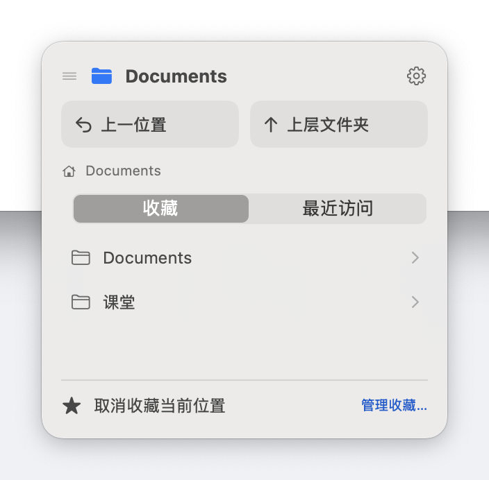
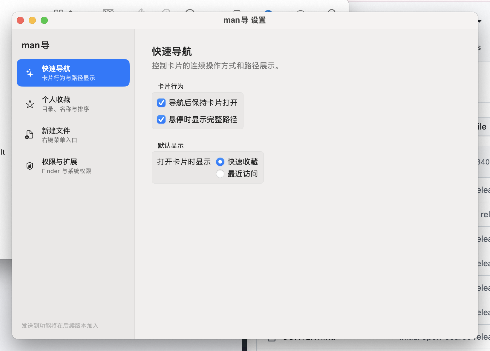

<p align="center">
  
</p>

# man导（FinderQuickNav）

一个 macOS Finder 效率工具：在文件夹空白处右键，即可弹出低遮挡的快速导航卡片，完成“返回上一位置、上层文件夹、路径层级跳转、收藏、最近访问、收藏当前位置”，同时保留独立的“新建文件”右键入口。

当前版本 **0.1.2**（2026-09-28）。本次更新将卡片中心对准点击时的鼠标位置，保留 0.1.1 的宿主唤起、重复请求防护和安装修复，详见 [更新记录](CHANGELOG.md)。项目提供源码和本地开发构建脚本，尚未提供经过 Apple 公证的通用安装包。

## 界面预览

在 Finder 空白处右键，菜单中会出现“快速导航”和“新建文件”入口：



点击“快速导航”后，卡片中心会对准点击菜单项时的鼠标位置；靠近屏幕边缘时，调整到可见区域内：



应用提供平铺式设置窗口，可管理快速导航行为、个人收藏、新建文件菜单和系统权限：



## 灵感来源

这个项目的交互思路来自 macOS 上的“超级右键”（iRightMouse）：在 Finder 空白处右键，就能快速完成新建文件、常用目录跳转等操作，不需要先打开应用。

man导 在此基础上做了自己的设计取舍：

- 交互入口保持一致：右键空白处 → 快速导航 / 新建文件；
- 核心交互重新设计：紧凑卡片以点击时的鼠标位置为中心，收藏与最近访问分页，路径悬停显示完整路径、点击即可复制；
- 宿主应用后台常驻（不占 Dock），未运行时右键也能自动拉起；
- 全部代码为本项目独立实现（Swift 6 + AppKit/SwiftUI），不包含“超级右键”的任何代码或资源。

## 功能

- Finder 空白处右键 → 292 × 286 pt 的紧凑卡片，中心对准点击时的鼠标位置并避开屏幕边界
- 收藏 / 最近访问分页显示，导航后保持当前分页
- 悬停路径行显示完整路径与路径层级按钮，点击路径任意位置复制当前文件夹路径
- 宿主后台常驻（不占 Dock）：应用未运行时，右键可自动拉起并直接弹出卡片
- 独立“新建文件”右键菜单：文件夹、TXT、Markdown、Word、Excel、PowerPoint（冲突安全命名）
- 平铺式设置窗口：快速导航、个人收藏、新建文件、权限与扩展
- 菜单栏房子图标入口（打开设置 / 退出）

## 环境要求

- macOS 14.0 或更高（开发机为 macOS 15.7.2，Apple Silicon）
- Xcode 16.4（Swift 6）
- 完整 Xcode 的命令行工具（`xcodebuild -version` 可用，仅 Command Line Tools 不够）
- XcodeGen 可选：仓库已包含生成的 `.xcodeproj`，正常构建不需要重新生成

## 构建与安装

先克隆仓库，在仓库根目录运行回归：

```bash
git clone https://github.com/chenzhitong823-eng/FinderQuickNav.git
cd FinderQuickNav
zsh FinderQuickNav/scripts/run-tests.sh
```

只检查源码能否编译、不安装应用时，可使用无签名构建：

```bash
xcodebuild -project FinderQuickNav/FinderQuickNav.xcodeproj \
  -scheme FinderQuickNav -configuration Release \
  -derivedDataPath FinderQuickNav/build \
  CODE_SIGNING_ALLOWED=NO build
```

要实际安装 Finder 扩展，需要本机可用的代码签名身份。仓库不包含证书或私钥；默认名 `FinderQuickNav Local Signing` 是开发机已有的本地证书，不会自动出现在其他电脑上。先查看自己的可用身份，再指定其名称或 SHA-1：

```bash
security find-identity -v -p codesigning
FQN_SIGNING_IDENTITY="你的代码签名身份" FQN_CONFIGURATION=Release \
  zsh FinderQuickNav/scripts/build-local.sh
zsh FinderQuickNav/scripts/install-local.sh
```

构建产物位于 `FinderQuickNav/build-local/FinderQuickNav.app`。安装器默认使用当前用户的 `~/Applications/FinderQuickNav.app`，先验证新应用，再归档旧安装，最后注册并核验扩展。它只停止目标安装路径的宿主和扩展进程，不重启整个 Finder。自定义安装目录时，两条命令使用相同的环境变量：

```bash
FQN_INSTALL_DIR="$HOME/Applications" zsh FinderQuickNav/scripts/install-local.sh
FQN_INSTALL_DIR="$HOME/Applications" zsh FinderQuickNav/scripts/verify-extension-registration.sh
```

安装器支持 `FQN_APP_PATH` 指定源 App；旧安装保存在 `FinderQuickNav/system/archive/`。回退时可把该归档 App 作为 `FQN_APP_PATH` 再运行安装器。

首次使用时按实际操作授予权限，详见 [权限说明](FinderQuickNav/docs/permissions.md)：

- 辅助功能（导航用快捷键返回/上一级）
- 自动化（控制 Finder）
- 文件与文件夹访问（由 macOS 在访问受保护目录时询问）

完全磁盘访问不是默认安装要求，也不能代替辅助功能、自动化或 Finder 扩展启用。请按实际需要选择授权。

## 排查右键无反应

1. 在用户主目录下的普通 Finder 文件夹中，右键**空白处**。当前默认只监听用户主目录，文件项菜单、外接磁盘和打开/保存对话框不保证覆盖。
2. 运行 `zsh FinderQuickNav/scripts/verify-extension-registration.sh`。检查必须同时满足：只有一个注册项、已启用、路径指向当前安装版。
3. 如点击后仍无卡片，在活动监视器中检查是否运行了归档目录的旧版 man导。相同 bundle ID 不代表相同应用副本；退出旧版后重试当前安装。
4. 如果刚安装后菜单重复或暂时缺失，可再次运行安装脚本刷新当前扩展会话。不要同时打开构建目录和归档目录中的副本。
5. macOS 的 Finder 扩展入口位置可能随系统版本变化；在系统设置中搜索“扩展”，确认 man导 的 Finder 扩展已启用。

## 技术架构

- **Finder Sync Extension**：提供空白处右键菜单，读取当前目录和鼠标坐标
- **宿主 App**（`LSUIElement` 后台代理）：承载非激活 `NSPanel` 卡片、导航、存储与新建文件服务
- **通信**：先在 App Group 保存待处理请求，再检查宿主完整路径并按需唤起；分布式通知传递实时请求，宿主按请求 ID 去重，保留最近 128 个已处理 ID
- **导航**：目录跳转使用 Finder Apple Event，返回/上一级使用辅助功能键盘事件，动作前先确认 Finder 前台

## 测试

```bash
zsh FinderQuickNav/scripts/run-tests.sh
# 可选：保留每项测试日志
FQN_TEST_LOG_DIR="$PWD/work/tmp/test-logs" zsh FinderQuickNav/scripts/run-tests.sh
```

测试入口汇总每项结果，有任何失败都会返回非零退出码，并自动清理本次测试的临时目录。模块回归不能代替真实 Finder 集成验收；当前定位证据见 [0.1.2 验收记录](FinderQuickNav/docs/verification-0.1.2.md)，此前稳定性验收见 [0.1.1 验收记录](FinderQuickNav/docs/verification-0.1.1.md)。

## 当前边界

- 卡片实现了屏幕边界避让；尚未读取文件图标位置来保证不遮挡任何图标。
- “快速导航”已是 man导 自身菜单组的第一项；Finder Sync 公开接口未提供整张 Finder 右键菜单的全局排序能力，无法指定它排在系统项或其他软件扩展之前。参见 [Apple Finder Sync 菜单接口说明](https://developer.apple.com/library/archive/documentation/General/Conceptual/ExtensibilityPG/Finder.html)。
- 路径搜索、全盘索引、云同步和 App Store 发布尚未实现。
- 双屏实机矩阵、长时 Instruments 性能观察尚未完成；macOS 14 和 Intel Mac 尚无本轮真机验证。

## 许可证

MIT License，详见 [LICENSE](LICENSE)。
